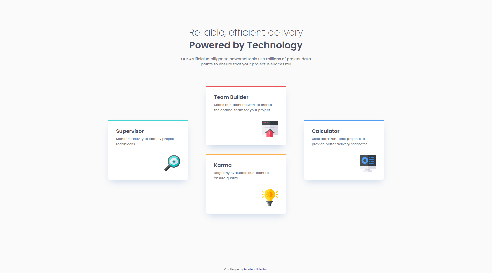

# Frontend Mentor - Four card feature section solution

This is my solution to the [Four card feature section challenge](https://www.frontendmentor.io/challenges/four-card-feature-section-weK1eFYK) on Frontend Mentor.

## Overview

A responsive four-card feature section built from a Frontend Mentor design. The layout adapts across breakpoints using CSS Grid and custom properties, focusing on clean structure and accessible, semantic markup.

### Screenshot

### Links

- Live Site URL: _Add your live site URL here_

### Built with

- Semantic HTML5
- CSS custom properties
- CSS Grid (responsive layout)
- Mobile-first workflow

## Acknowledgments

- Challenge by [Frontend Mentor](https://www.frontendmentor.io).
